# Pimp your time lapses

## Because time lapses are boring now
Doing time lapses was a performance in the 2000's because basically no digital camera was equiped to do this apart from some high end products with remote control. I was cheap so my option was tinkered intervallometers mounted on butchered digital cameras for many years. I was always interested by image fusion like averaging a bunch of images, visualize the flow of time on a still image or taking the maximum of pixels to do circumpolar circles. Which I did, basically with the prototypes of codes proposed here. I even built my own [time lapse machine from a Game Boy Camera](https://github.com/Raphael-Boichot/Mitsubishi-M64282FP-dashcam), because why not.

Now any cheap camera / phone is able to do that.

I was recently the happy owner of a gifted Osmo Pocket 3. It looks like a super camera to ski within avalanches, kill you in wingsuit and generally put you in dangerous situation for fame. I have much less cool hobbies in general and am yet famous. hopefully, it appears that the Osmo Pocket 3 is a marvelous time lapse machine in addition to be a quite able stabilized camera for filming deadly situations.

Put it on a tripod, fire, come back 5 hours later. All I needed. Now back to the codes.

## The codes back from the dead
The codes proposed here are revisited versions of all the oddities roting on my hard drive since years to extract cool images from movies and timelapses from the said Osmo Pocket 3 or any GoPro like camera / phone. They basically extract individual frames from a short movie (1000-2000 images maximum), plot average, maximum and minimum, do slit-scans and time slices of the batch of frames. Sometimes it gives something surprisingly cool even with very boring scenes.

Codes are in Matlab but I guess that you are a big boy / girl able to convert them in Python or whatever opensource-my-ass langage of your own.

# Show time
## Circular Slices
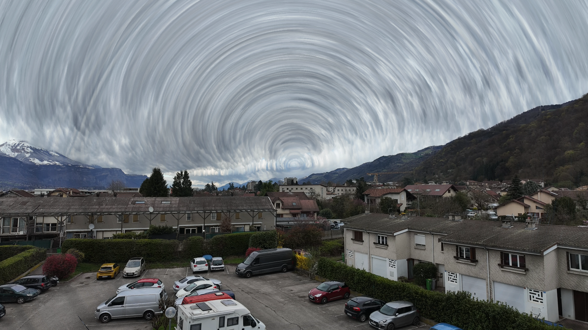
5 hours, one image every 30 seconds, time flowing from center to border

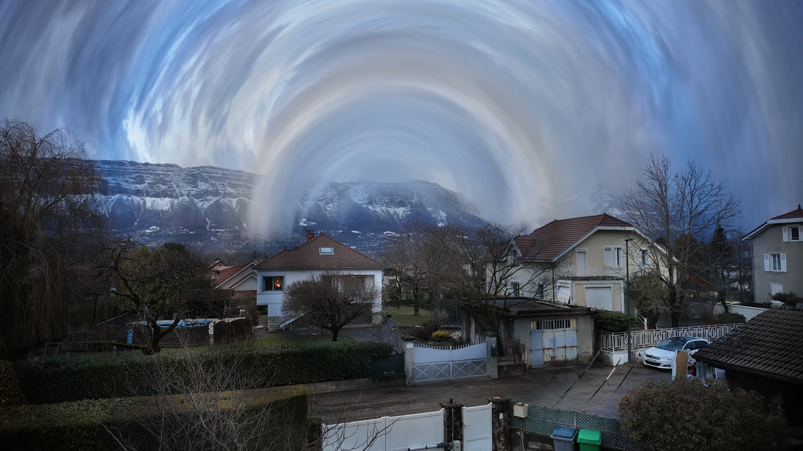
5 hours, one image every 30 seconds, time flowing from center to border

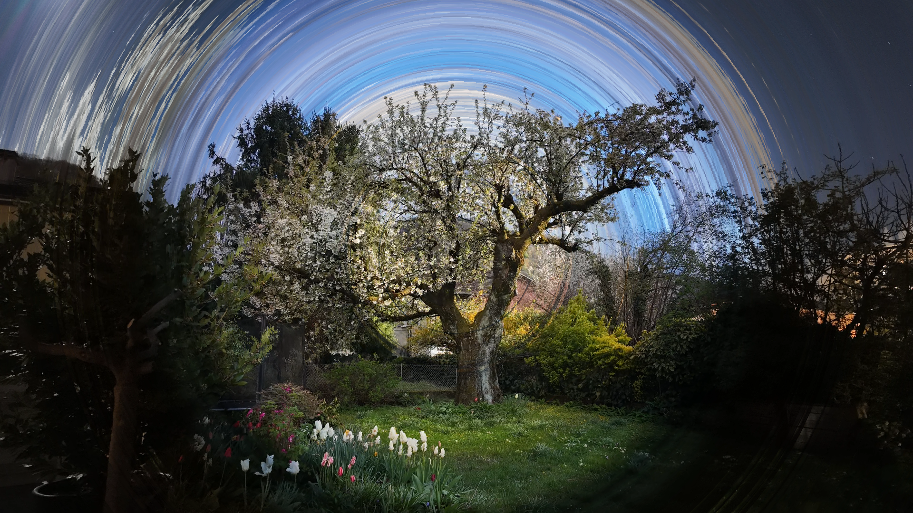
5 hours, one image every 30 seconds, time flowing from center to border

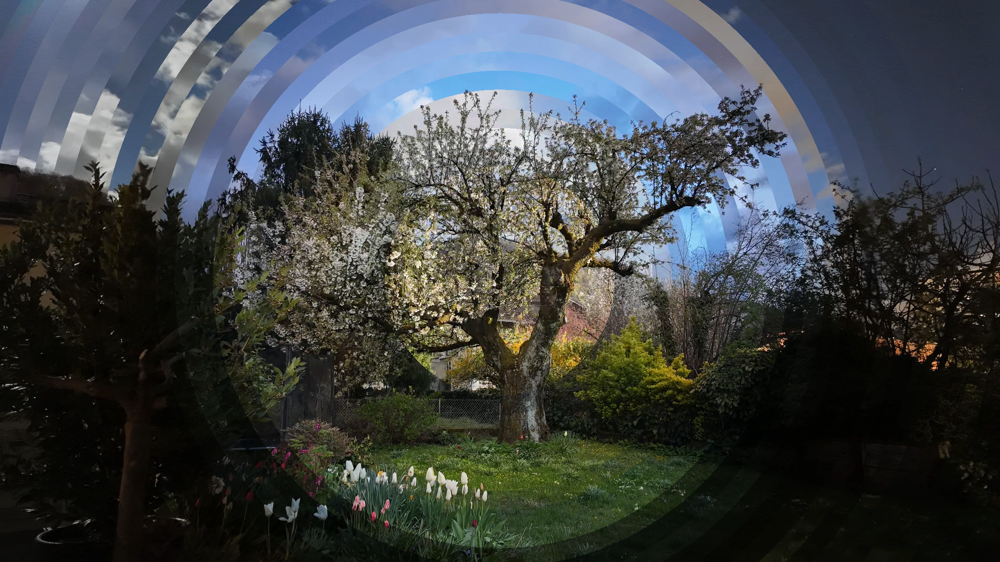
5 hours, one image every 30 seconds (downsampled), time flowing from center to border

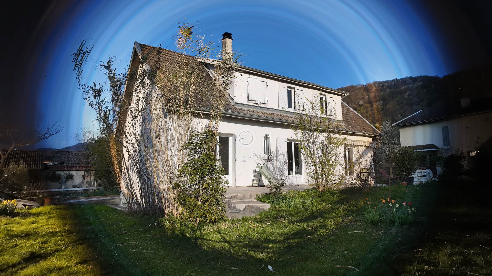
5 hours, one image every 30 seconds, time flowing from center to border

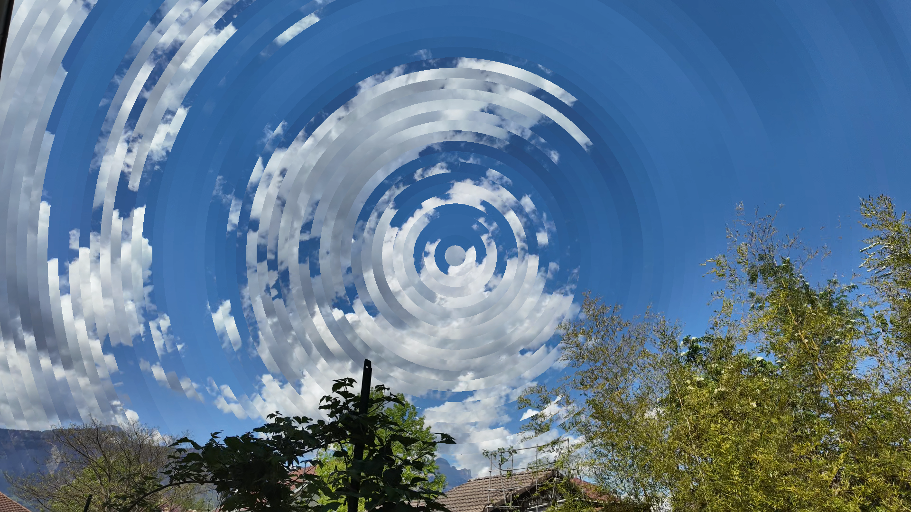
1 hour, one image every 5 seconds (downsampled), time flowing from center to border

## Inclined Slice
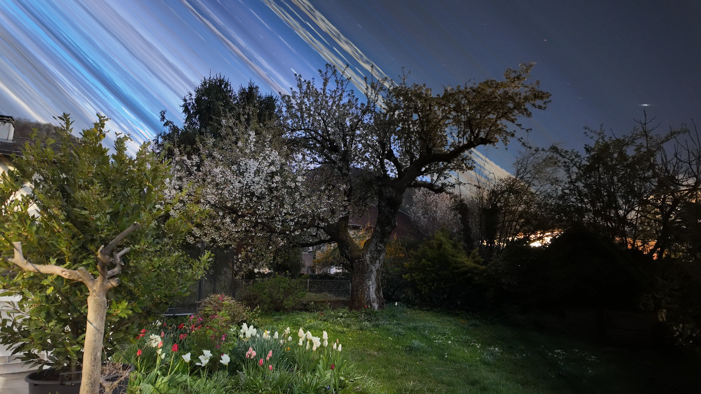
5 hours, one image every 30 seconds, time flowing from bottom left to top right

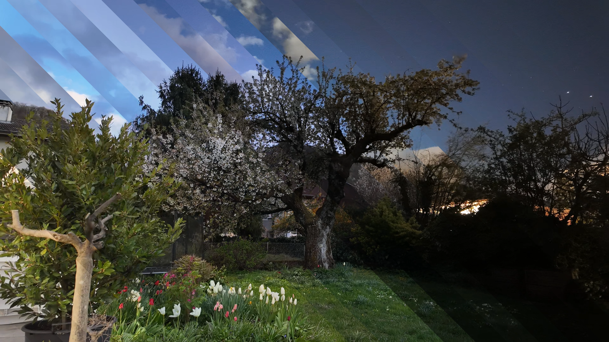
5 hours, one image every 30 seconds (downsampled), time flowing from bottom left to top right

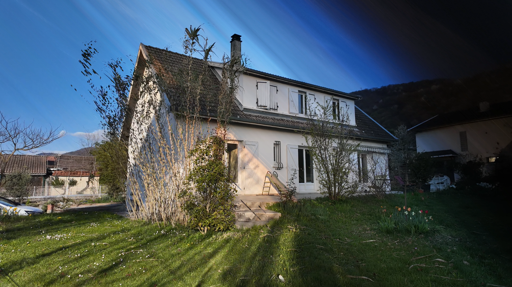
5 hours, one image every 30 seconds, time flowing from bottom left to top right

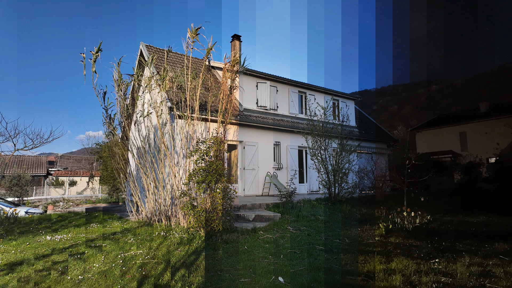
5 hours, one image every 30 seconds (downsampled), time flowing from left to right

## Maximum Projection
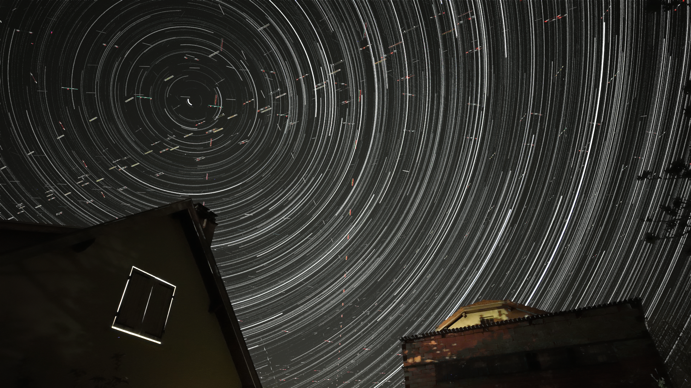
5 hours, one image every 10 seconds

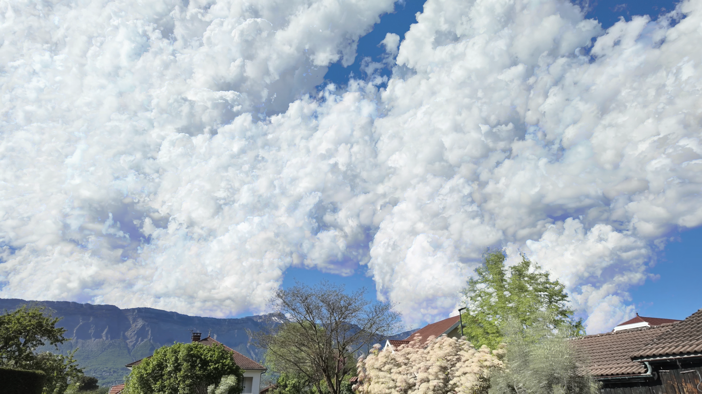
1 hour, one image every 10 seconds (downsampled)

## Mosaic
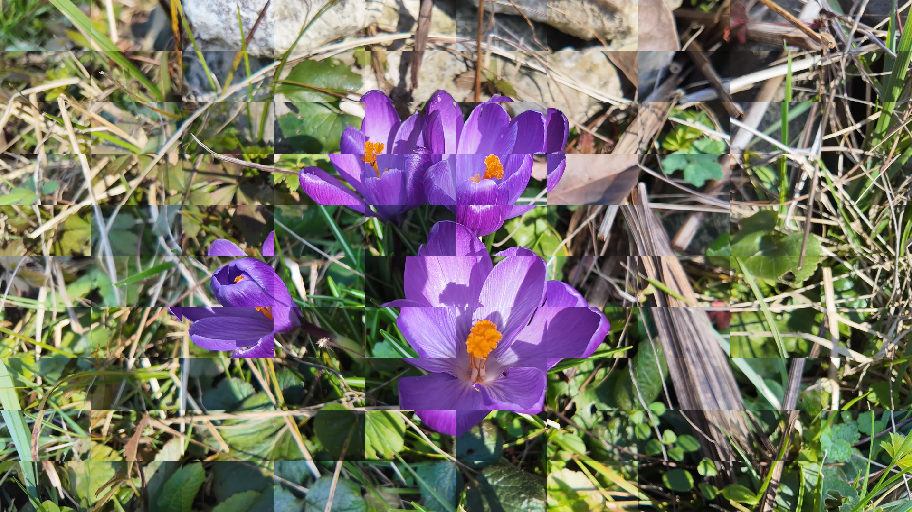
5 hours, one image every 30 seconds, random time for each block
